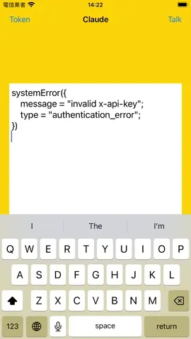

# WWSimpleAI+Claude

[](https://developer.apple.com/swift/) [](https://developer.apple.com/swift/)  [](https://developer.apple.com/swift/) [](https://developer.apple.com/swift/)

## [Introduction - 簡介](https://swiftpackageindex.com/William-Weng)
- [Simply use the functionality of Anthropic Claude AI.](https://docs.anthropic.com/zh-TW/api)
- [簡單的使用Anthropic-Claude-AI功能。](https://claude.ai)



### [Installation with Swift Package Manager](https://medium.com/彼得潘的-swift-ios-app-開發問題解答集/使用-spm-安裝第三方套件-xcode-11-新功能-2c4ffcf85b4b)
```
dependencies: [
    .package(url: "https://github.com/William-Weng/WWSimpleAI_Claude.git", .upToNextMajor(from: "0.1.0"))
]
```

## [Function - 可用函式](https://william-weng.github.io/2025/01/docker容器大家一起來當鯨魚搬運工吧/)
|函式|功能|
|-|-|
|talk(content:maxTokens:)|說話模式|
|tokenCount(content:)|計算訊息字符數|

## [Example](https://ezgif.com/video-to-webp)
```swift
import UIKit
import WWSimpleAI_Ollama
import WWSimpleAI_Claude

final class ViewController: UIViewController {

    @IBOutlet weak var resultTextField: UITextView!
    
    private let apiKey = "<API-KEY>"
    
    override func viewDidLoad() {
        super.viewDidLoad()
        WWSimpleAI.Claude.configure(apiKey: apiKey)
    }
    
    @IBAction func talk(_ sender: UIBarButtonItem) {
        
        Task {
            let result = await WWSimpleAI.Claude.shared.talk(content: "今天是星期幾？")
            
            switch result {
            case .failure(let error): resultTextField.text = "\(error)"
            case .success(let value): resultTextField.text = "\(value)"
            }
        }
    }
    
    @IBAction func tokenCount(_ sender: UIBarButtonItem) {
        
        Task {
            let result = await WWSimpleAI.Claude.shared.tokenCount(content: "What day is it today?")
            
            switch result {
            case .failure(let error): resultTextField.text = "\(error)"
            case .success(let value): resultTextField.text = "\(value)"
            }
        }
    }
}
```
